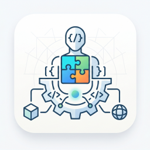

# ClauDeck

<p align="center">
  
</p>

ClauDeck 是一个用于管理 Claude Code plugins 的本地桌面工具，提供 PyQt6 + Fluent 风格界面。它可以查看、启用/禁用、卸载已安装插件，并在 Claude Code 配置变化后自动修复 `enabledPlugins`，减少插件状态丢失、被项目配置覆盖，或被外部会话意外改写的问题。

English summary: ClauDeck is a local desktop manager for Claude Code plugins. It provides a GUI, one-shot sync, watcher, and SessionStart hook to keep `enabledPlugins` aligned with installed plugins.

## 适合谁

如果你遇到过这些情况，ClauDeck 会比较有用：

- 已经在使用 Claude Code plugins，希望有一个可视化管理界面。
- 经常切换模型、provider、项目配置或 Claude settings，导致插件状态被覆盖。
- 想快速查看插件 README、Skills、Hooks、Agents、Commands 和安装记录。
- 想把这套插件同步逻辑移植到自己的 Claude Code 配置或项目模板中。

## 功能概览

- PyQt6 + Fluent 风格桌面界面。
- 紧凑的左侧插件列表、右侧常驻详情面板，默认把更多宽度留给插件详情。
- 查看插件 README、Skills、Hooks、Agents、Commands 和安装记录。
- 一键启用 / 禁用插件，一键卸载插件并清理本地缓存与 JSON 记录。
- 已启用插件自动排在前面，禁用状态使用更醒目的红色标识。
- 支持用户级与项目级 Claude settings 合并视图。
- 支持一次性同步、后台 watcher、Claude Code `SessionStart` hook 三种自动修复方式。
- 支持查看 watcher 状态，并在 GUI 中手动启动或停止当前 watcher。
- Hook、watcher、同步策略等容易混淆的选项带有悬浮说明。
- 同步策略可配置：
  - 自动补齐新增插件。
  - 单向模式：外部修改会被修回 ClauDeck 记录的状态。
  - 双向模式：接受外部对插件启用状态的修改。
- 支持自定义 Claude 配置目录、项目目录和 Claude CLI 路径。

## 前置要求

- Python 3.10+
- 已安装 Claude Code CLI，并且默认可通过 `claude` 调用。
- GUI 依赖：`PyQt6` 和 `PyQt6-Fluent-Widgets`，版本范围见 `requirements.txt`。

安装依赖：

```bash
python -m pip install -r requirements.txt
```

## 快速开始

```bash
git clone https://github.com/yhgeo/ClauDeck.git
cd ClauDeck
python -m venv .venv
python -m pip install -r requirements.txt
python app.py
```

Windows PowerShell 激活虚拟环境：

```powershell
.\.venv\Scripts\Activate.ps1
```

Windows 也可以直接使用批处理启动 GUI：

```bat
run_plugin_manager.bat
```

如果你的 Claude 配置目录或 Claude CLI 路径不是默认值：

```bash
python app.py --claude-dir /path/to/.claude --project-dir /path/to/project --claude-bin /path/to/claude
```

## 常用命令

| 场景 | 命令 |
| --- | --- |
| 启动 GUI | `python app.py` |
| 启动 GUI，并指定配置目录、项目目录和 Claude 路径 | `python app.py --claude-dir /path/to/.claude --project-dir /path/to/project --claude-bin /path/to/claude` |
| 手动执行一次同步 | `python sync_plugins.py --json` |
| 只检查同步状态，不写入文件 | `python sync_plugins.py --check --json` |
| watcher 执行一次同步后退出 | `python settings_watcher.py --once --json` |
| 常驻运行 watcher | `python settings_watcher.py` |
| 调整 watcher 轮询间隔 | `python settings_watcher.py --interval 1.0` |
| 查看 hook 状态 | `python hook_manager.py --json status` |
| 安装 / 更新自动修复 hook | `python hook_manager.py install` |
| 移除自动修复 hook | `python hook_manager.py remove` |
| 停止当前正在运行的 watcher | `python hook_manager.py --json stop-watcher` |
| 启动 Claude 前先同步插件 | `python claude_wrapper.py -- <claude-args>` |

使用临时或自定义 Claude 配置目录测试时，建议显式传入 `--claude-dir`，避免影响真实配置：

```bash
python sync_plugins.py --claude-dir /path/to/test/.claude --check --json
python settings_watcher.py --claude-dir /path/to/test/.claude --once --json
python hook_manager.py --claude-dir /path/to/test/.claude --json status
```

## 同步模式

ClauDeck 主要维护 Claude 配置中的 `enabledPlugins`。同步偏好保存在 Claude 配置目录下的 `plugins/claudeck_state.json`。

- **自动补齐新增插件**：已安装但缺失于 `enabledPlugins` 的全局插件会被补回。
- **单向模式**：以 ClauDeck 记录的 `desiredEnabledPlugins` 为准。外部在 Claude Code 或 settings 中启用/禁用插件后，下次同步会修回 ClauDeck 记录的状态；新发现且尚未记录目标状态的全局插件默认视为启用。
- **双向模式**：以外部 settings 的当前状态为准，并把变化写回 ClauDeck 记录。

项目级插件只应在对应项目中启用。同步逻辑会避免把只有项目安装记录的插件错误地全局启用。

## Hook 与 Watcher

在 GUI 中点击 `安装 Hook` 后，ClauDeck 会把一个 Claude Code `SessionStart` hook 写入当前用户的 `~/.claude/settings.json`。之后 Claude Code 新会话触发 `SessionStart` 时会先执行同步，并启动后台 watcher。

如果你需要临时关闭后台同步，可以在 GUI 左侧状态区点击 `停止 Watcher`。这只会停止当前 watcher 进程，不会移除 SessionStart hook；如果 hook 仍安装，下次 Claude Code 会话启动时 watcher 可能会重新启动。

如果 watcher 未运行，GUI 左侧会显示 `启动 Watcher`。这个按钮会立即执行一次同步并启动后台监听，不需要等待 Claude Code 是否触发 SessionStart hook。

这个 hook 使用你本机 clone 的项目路径生成，因此每台电脑下载项目后都需要在本机安装一次。如果移动了项目目录，重新执行安装命令即可更新 hook 路径。

## 它会修改什么

ClauDeck 主要读取和维护 Claude 配置目录下的这些文件：

- `~/.claude/plugins/installed_plugins.json`
- `~/.claude/settings.json`
- `~/.claude/plugins/claudeck_state.json`

同步逻辑只负责维护 `enabledPlugins` 和 ClauDeck 自己的状态文件。它应保留无关设置，例如 API keys、base URL、模型/provider 配置、环境变量等。

hook 管理器只管理命令中包含 `claudeck-plugin-sync-v1` 标记的 ClauDeck hook。安装、更新或移除自动同步 hook 时，不会删除其它 Claude Code hooks。

watcher 日志位置：

```text
~/.claude/logs/plugin_sync_watcher.log
```

watcher 状态文件位置：

```text
~/.claude/logs/plugin_sync_watcher_status.json
```

日志会记录启动、文件变化检测、自动补回插件映射、异常和退出事件。watcher 会自动保留最近 2 天内的日志记录。

## 移植到自己的环境

如果你想把 ClauDeck 用在自己的配置、项目模板或 fork 中，通常只需要关注这些点：

1. **配置目录**：默认是 `~/.claude`。测试或迁移时优先使用 `--claude-dir /path/to/test/.claude`。
2. **项目目录**：如果要同时读取项目级 `.claude/settings.json` 和 `.claude/settings.local.json`，启动 GUI 或 CLI 时传入 `--project-dir /path/to/project`。
3. **hook 路径**：SessionStart hook 会写入当前 clone 的本机路径。换电脑、移动目录或打包成 exe 后，需要重新安装 hook。
4. **同步规则**：共享逻辑在 `plugin_sync.py`，GUI、watcher、CLI 都复用它。移植时优先复用这个模块，不要复制多套规则。
5. **安全边界**：`plugin_content.py` 只浏览已发现的插件内容，不执行插件代码，也不读取插件根目录之外的任意路径。

## 主要文件

- `app.py`：PyQt6 GUI 启动入口，也负责打包后的内部模式分发。
- `ui/`：PyQt6 + Fluent 界面模块。
- `plugin_store.py`：插件记录与 Claude settings 的读写层。
- `plugin_sync.py`：共享的 `enabledPlugins` 同步规则。
- `plugin_content.py`：只读插件内容浏览辅助逻辑。
- `sync_plugins.py`：一次性同步 / 检查 CLI。
- `settings_watcher.py`：后台监听与自动修复。
- `hook_manager.py`：安装、更新、移除和启动 ClauDeck 管理的 SessionStart hook。
- `claude_wrapper.py`：启动 Claude Code 前先同步插件的包装器。
- `run_plugin_manager.bat`：Windows 下快速启动 GUI。
- `assets/claudeck.png`：应用图标。
- `plugin_manager_ui.py`：旧 Tkinter 实现，保留作参考 / 回退。

## 开发与验证

当前仓库还没有专门的测试套件。修改代码后，至少运行维护模块的编译检查：

```bash
python -m py_compile app.py hook_manager.py plugin_content.py plugin_manager_ui.py plugin_store.py plugin_sync.py settings_watcher.py sync_plugins.py claude_wrapper.py ui/main_window.py ui/panels/plugin_list_panel.py ui/panels/plugin_detail_panel.py ui/widgets/plugin_card.py ui/widgets/summary_card.py ui/workers/tasks.py
```

CLI smoke checks：

```bash
python sync_plugins.py --check --json
python hook_manager.py --json status
```

`settings_watcher.py --once` 会执行一次真实同步，可能写入目标 Claude 配置目录。建议只在临时配置目录或确认可写入当前配置时运行：

```bash
python settings_watcher.py --claude-dir /path/to/test/.claude --once --json --quiet
```

如果修改了 UI，建议同时启动 GUI 手动检查主流程：

```bash
python app.py
```

## 构建 Windows 可执行文件

PyInstaller 不在 `requirements.txt` 中，如需构建请先单独安装：

```bash
python -m pip install PyInstaller
```

构建命令：

```bash
python -m PyInstaller --noconfirm --clean --windowed --name ClauDeck --add-data "assets;assets" app.py
```

生成物通常位于 `dist/`。仓库没有提交 `.spec` 或 release 自动化配置。

## License

[MIT License](LICENSE)
