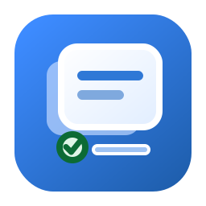

# ClauDeck

<p align="center">
  
</p>

ClauDeck 是一个用于管理 Claude Code plugins 的本地桌面工具，提供 PyQt6 + Fluent 风格界面。它可以可视化查看、启用/禁用、卸载已安装插件，并在切换模型或配置后自动修复 `enabledPlugins`，避免插件在 Claude Code 中“消失”。

English summary: ClauDeck is a local desktop manager for Claude Code plugins, with GUI management and automatic `enabledPlugins` repair.

## 当前版本亮点

- 支持用户级与项目级 Claude settings 合并视图，减少项目配置覆盖导致的插件状态偏差。
- 支持在 GUI 中安装 / 更新 / 移除 ClauDeck 管理的 SessionStart hook。
- 新增 watcher 运行状态查看与手动停止入口，遇到需要临时关闭后台同步的场景可以直接在界面处理。
- 自动同步策略可配置：既可以补齐新增插件，也可以选择单向维护或双向接受外部插件启用状态变化。

## 适合谁

如果你遇到过这些情况，ClauDeck 会比较有用：

- 已经在使用 Claude Code plugins，希望有一个可视化管理界面
- 经常切换 Claude Code 的模型、provider 或配置，导致 plugins 状态丢失
- 想快速查看插件 README、Skills、Commands、Agents 和安装记录
- 想用 watcher 或 SessionStart hook 自动保持 `enabledPlugins` 与已安装插件同步

## 功能

- PyQt6 + Fluent 风格桌面界面
- 左侧插件卡片列表，右侧常驻详情面板
- 查看插件 README、Skills、Commands、Agents 和安装记录
- 一键启用 / 禁用插件
- 一键卸载插件，并清理本地缓存与 JSON 记录
- 一次性同步、后台 watcher、Claude Code SessionStart hook 三种自动修复方式
- GUI 中查看 watcher 运行状态，并可手动停止当前 watcher
- 支持自定义 Claude 配置目录和 Claude 可执行文件路径

## 前置要求

- Python 3.10+
- 已安装 Claude Code CLI，并且默认可通过 `claude` 调用
- GUI 依赖：`PyQt6` 和 `PyQt6-Fluent-Widgets`，版本范围见 `requirements.txt`

安装依赖：

```bash
python -m pip install -r requirements.txt
```

## 快速开始

```bash
git clone https://github.com/yhgeo/ClauDeck.git
cd ClauDeck
python -m venv .venv
python -m pip install -r requirements.txt
python app.py
```

Windows PowerShell 激活虚拟环境：

```powershell
.\.venv\Scripts\Activate.ps1
```

Windows 也可以直接使用批处理启动 GUI：

```bat
run_plugin_manager.bat
```

如果你的 Claude 配置目录或 Claude CLI 路径不是默认值：

```bash
python app.py --claude-dir /path/to/.claude --claude-bin /path/to/claude
```

## 常用命令

| 场景 | 命令 |
| --- | --- |
| 启动 GUI | `python app.py` |
| 启动 GUI，并指定配置目录和 Claude 路径 | `python app.py --claude-dir /path/to/.claude --claude-bin /path/to/claude` |
| 手动执行一次同步 | `python sync_plugins.py --json` |
| 只检查同步状态，不写入文件 | `python sync_plugins.py --check --json` |
| watcher 执行一次同步后退出（会写入配置） | `python settings_watcher.py --once --json` |
| 常驻运行 watcher | `python settings_watcher.py` |
| 调整 watcher 轮询间隔 | `python settings_watcher.py --interval 1.0` |
| 查看 hook 状态 | `python hook_manager.py --json status` |
| 安装 / 更新自动修复 hook | `python hook_manager.py install` |
| 移除自动修复 hook | `python hook_manager.py remove` |
| 停止当前正在运行的 watcher | `python hook_manager.py --json stop-watcher` |
| 启动 Claude 前先同步插件 | `python claude_wrapper.py -- <claude-args>` |

针对临时或自定义 Claude 配置目录测试：

```bash
python sync_plugins.py --claude-dir /path/to/.claude --check --json
python settings_watcher.py --claude-dir /path/to/.claude --once --json
python hook_manager.py --claude-dir /path/to/.claude --json status
python hook_manager.py --claude-dir /path/to/.claude --json stop-watcher
```

## 自动修复 hook

在 GUI 中点击 `安装会话启动 hook` 后，ClauDeck 会把一个可移植的 Claude Code `SessionStart` hook 写入当前用户的 `~/.claude/settings.json`。之后 Claude Code 会话启动时会后台启动 watcher，切换模型或配置后也会自动补回缺失的 `enabledPlugins`。

如果你需要临时关闭后台同步，可以在 GUI 左侧状态区点击 `停止 watcher`。这只会停止当前 watcher 进程，不会移除 SessionStart hook；如果 hook 仍安装，下次 Claude Code 会话启动时 watcher 可能会重新启动。

CLI 备用命令：

```bash
python hook_manager.py --json status
python hook_manager.py install
python hook_manager.py remove
python hook_manager.py --json stop-watcher
```

这个 hook 使用你本机 clone 的项目路径生成，因此每台电脑下载项目后都需要在本机安装一次。如果移动了项目目录，重新执行安装命令即可更新 hook 路径。

## 它会修改什么

ClauDeck 主要读取和维护 Claude 配置目录下的两个文件：

- `~/.claude/plugins/installed_plugins.json`
- `~/.claude/settings.json`

同步逻辑只负责补齐和规范化 `enabledPlugins`。它应保留无关设置，例如 API keys、base URL、模型/provider 配置、环境变量等。

hook 管理器只管理命令中包含 `claudeck-plugin-sync-v1` 标记的 ClauDeck hook。安装、更新或移除自动同步 hook 时，不会删除其它 Claude Code hooks。

watcher 日志位置：

```text
~/.claude/logs/plugin_sync_watcher.log
```

watcher 状态文件位置：

```text
~/.claude/logs/plugin_sync_watcher_status.json
```

日志会记录启动、文件变化检测、自动补回插件映射、异常和退出事件。

## 主要文件

- `app.py`：PyQt6 GUI 启动入口，也负责打包后的内部模式分发
- `ui/`：PyQt6 + Fluent 界面模块
- `plugin_store.py`：插件记录与 Claude settings 的读写层
- `plugin_sync.py`：共享的 `enabledPlugins` 同步规则
- `plugin_content.py`：只读插件内容浏览辅助逻辑
- `sync_plugins.py`：一次性同步 / 检查 CLI
- `settings_watcher.py`：后台监听与自动修复
- `hook_manager.py`：安装、更新、移除和启动 ClauDeck 管理的 SessionStart hook
- `claude_wrapper.py`：启动 Claude Code 前先同步插件的包装器
- `run_plugin_manager.bat`：Windows 下快速启动 GUI
- `assets/claudeck.svg`：应用图标
- `plugin_manager_ui.py`：旧 Tkinter 实现，保留作参考 / 回退

## 开发与验证

当前仓库还没有专门的测试套件。修改代码后，至少运行维护模块的编译检查：

```bash
python -m py_compile app.py hook_manager.py plugin_content.py plugin_manager_ui.py plugin_store.py plugin_sync.py settings_watcher.py sync_plugins.py claude_wrapper.py ui/main_window.py ui/panels/plugin_list_panel.py ui/panels/plugin_detail_panel.py ui/widgets/plugin_card.py ui/widgets/summary_card.py ui/workers/tasks.py
```

CLI smoke checks：

```bash
python sync_plugins.py --check --json
python hook_manager.py --json status
```

`settings_watcher.py --once` 会执行一次真实同步，可能写入目标 Claude 配置目录。建议只在临时配置目录或确认可写入当前配置时运行：

```bash
python settings_watcher.py --claude-dir /path/to/test/.claude --once --json --quiet
```

如果修改了 UI，建议同时启动 GUI 手动检查主流程：

```bash
python app.py
```

## 构建 Windows 可执行文件

PyInstaller 不在 `requirements.txt` 中，如需构建请先单独安装：

```bash
python -m pip install PyInstaller
```

构建命令：

```bash
python -m PyInstaller --noconfirm --clean --windowed --name ClauDeck --add-data "assets/claudeck.svg;assets" app.py
```

生成物通常位于 `dist/`。仓库没有提交 `.spec` 或 release 自动化配置。

## License

[MIT License](LICENSE)
